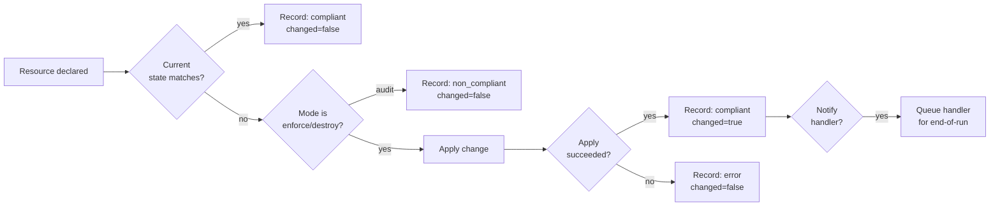

# Resources & the DSL

A **resource** is the unit of declared intent. Every resource in SSM Converge follows the same three-phase contract — that uniformity is what makes the DSL predictable.

## The check / apply / record contract

Every resource:

1. **Checks** the current state on the host.
2. **Applies** the change *only if* the state differs from the desired state. Skipped entirely in `audit` mode.
3. **Records** the outcome (`compliant` / `non_compliant` / `error`) into the run's compliance report.



This contract is enforced by the library, not by convention. Resource authors implement small `_check` and `_apply` functions and call `_record_result`. The mode-handling, notification queueing, drift-counting, and report assembly are all done by the engine.

## Why this matters

### Idempotency comes for free

Run a configuration twice in a row. The second pass:

- Reports every resource as `compliant, changed=false`.
- Doesn't restart services that are already running.
- Doesn't re-download files that already match.
- Doesn't re-execute commands whose `creates` guard is satisfied.

This is the whole point. A configuration is a *description of desired state*, not a script of imperative steps.

### Drift detection is the same code as enforcement

`audit` mode is just `enforce` mode with the apply phase short-circuited. The same check that decides "do I need to fix this?" is the check that decides "is the system out of compliance?". You can't have one without the other.

### The report is structured, not free-text

Every resource records:

- `resource` — the name and identity (e.g. `package/nginx`, `file/etc/nginx/nginx.conf`).
- `status` — one of `compliant`, `non_compliant`, `error`.
- `changed` — boolean; did this run actually modify state?
- `detail` — one-line context (e.g. `mode is 0755, want 0644`, or `exit 5: ls: /no/such/path`).
- `check_duration_ms`, `apply_duration_ms` — performance signal.
- `timestamp`, `run_id`.

The whole report serializes to a JSON document that downstream consumers (S3 audit lakes, SSM Compliance, your SIEM) can parse without bespoke regex. See [Concepts › Compliance Reporting](reporting.md).

## The DSL surface

Resources are bash functions on Linux and PowerShell functions on Windows. The shape is intentionally narrow:

=== "Linux"

    ```bash
    # State as second positional arg, attributes as key/value pairs.
    package 'nginx' installed
    package 'nginx' installed version '1.24'
    package 'telnet' uninstalled

    file '/etc/nginx/nginx.conf' present \
      source 's3://DOC-EXAMPLE-BUCKET/nginx.conf' \
      owner 'root' mode '0644' \
      notify 'reload-nginx'

    service 'nginx' running enabled
    ```

=== "Windows"

    ```powershell
    # State as required parameter, attributes as named -Properties.
    Package        'nginx' Installed
    Package        'nginx' Installed -Version '1.24'
    Package        'telnet' Uninstalled

    File 'C:\inetpub\wwwroot\web.config' Present `
         -Source 's3://DOC-EXAMPLE-BUCKET/web.config' `
         -Notify 'restart-iis'

    WindowsService 'W3SVC' Running -StartupType Automatic
    ```

The two platforms intentionally use the conventions of their language - lowercase-underscore on Linux, PascalCase on Windows. The semantics, the report format, the modes, the handlers — all identical.

## Resource categories

| Category | Linux | Windows |
|----------|-------|---------|
| **Filesystem** | `file`, `file_content`, `directory` | `File`, `File-Content`, `Directory` |
| **Packages** | `package` | `Package` |
| **Services** | `service` | `WindowsService` |
| **Users & groups** | `user`, `group` | `LocalUser`, `LocalGroup` |
| **System config** | `sysctl`, `timezone`, `locale`, `host_entry`, `mount_fs` | `RegistryKey`, `EnvironmentVariable`, `HostEntry`, `WindowsFeature` |
| **Scheduling** | `cron` | `ScheduledTask` |
| **Text editing** | `line_in_file` | (use `RegistryKey` or `File-Content`) |
| **Escape hatch** | `execute` | `Execute` |
| **DSC bridge** | — | `DscResource` (wraps any installed PSDSC module) |

## When to reach for `execute`

The `execute` / `Execute` resource exists for things that don't fit a more specific primitive. Examples:

- Vendor `.deb`, `.rpm`, `.msi`, `.exe` installers fetched from an artifact repo.
- One-shot bootstrap commands (license activation, cluster join, custom CLI setup).
- Build / compile / migration steps that don't have a declarative equivalent.

The discipline: **always pair `execute` with a guard.** A guardless `execute` runs every pass, defeating the point of idempotency. The three guards (`creates`, `only_if`, `not_if`) make the resource truthfully report `compliant, changed=false` once the work is done.

```bash
# Linux: install a vendor agent, idempotently.
file '/tmp/agent.rpm' present source 's3://artifacts/agent.rpm'

execute 'install-agent' \
  command 'rpm -i /tmp/agent.rpm' \
  not_if  'rpm -q vendor-agent'   # rc=0 if package already installed
```

See the [`execute`](../resources/linux/execute.md) and [`Execute`](../resources/windows/Execute.md) resource pages for the full guard semantics.

## Custom resources

You can define your own resource by following the same shape as the built-ins. Drop a new `.sh` (Linux) or `.ps1` (Windows) file into `resources/` — the engine globs the directory at startup and sources every file. Your function gets access to the engine helpers (`_should_apply`, `_record_result`, `_log_changed`, etc.) and reports compliance the same way every other resource does.

For most cases, you won't need to. The 30 built-ins plus `execute` plus `DscResource` cover the everyday surface. But the door is open.
